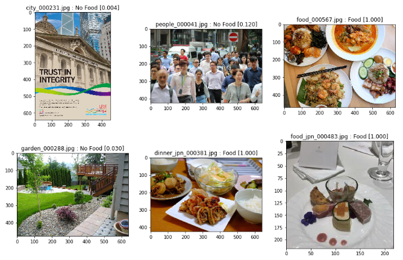

# Food vs No-food image classification

This model performs binary classifiation in which input images are classified as "food photo" or not.



I personally like taking picutures of my own cookings and beautiful meals I ate at restaurants and cafes. Also food photos are so popular in these days thanks to Instagram. Everyone loves to see yummy-looking food photos! However, there are so many styles of cooking. Colours, shapes and layout could very much vary from photo to photo. So I was curious about how well DL was able to detect food images from no-food images.

## Summary

I applied transfer learning to build the food/no-food classification CNN model. The pretrained model I used was Resnet50 v2. I removed the final layer of Resnet50 and instead attached a block which consists of a GlobalAveragePooling layer with dropout, a fully connected layer with dropout, and one more fully connected layer that performs binary classification as output.

During a lot of repetition of training, I noticed that the model seemed to start overfitting in very early stage. It reached to above 90% accuracy both training and validation at second epoch. I ended up with just 2 epochs to train the model with very low learning rate using Adam optimiser.

In test, the model performed perfect classification with food images(recall = 1.0), while false positive rate (proportion of no-food images classified as food) was around 0.19 with threshold 0.5. I found that food images were classified as food with very high probability (0.99-1.0) whereas no-food images were predicted with from 0.0(no-food) to 1.0(food) probability, even though the majority of no-food samples was predicted with under 0.5 probability. Finally I set the threshold of this binary classification at 0.99, which marked the highest accuracy (0.97).

If I could study this project further, I would like to know the cause of the skewness of this classification (the best threshold is highly skewed to "food") and deal with it.

## Dataset

I obtained images from the internet, then sorted them into "food photo" or "no-food photo". No-food photo could includes anything like landscapes, people, animals, vehicles, furniture etc. except for cooking.

- Food : 5206 photos
- No-food : 5077 photos

These images were split into training set, validation set, and test set as following:

 - Training : food 4165, no-food 4046 (total 8211)
 - Validation : food 521, no-food 507 (total 1028)
 - Test : food 520, no-food 506 (total 1026)

## Repository

- `Food_project_TransferLearning.ipynb` : Transfer Learning using ResNet50v2. This is the main project.

- `Food_project_smallDNN.ipynb` : Small CNN from scratch.

- `Food_Project_mytest.ipynb` : Test script to test the model created using transfer learning with my own images. When you test on your own images, make `my_testdata` directory in this repo and put photos in there before running this script.

- `Makedata.ipynb` : Script to prepare image data. This copies images from `food/` `no_food/` to `train/` `valid/` `test/` directory with checking, resizing, and converting images into jpg. (Made just for my convenience)

- `sample_data/` : Some samples of image files extracted from the dataset mentioned in the previous section(I won't upload all dataset because the size will be too large).

- `food_model_resnet_1573727092.h5` : Trained model file created in `Food_project_TransferLearning.ipynb`.

## Run

To run `Food_project_TransferLearning.ipynb` in your own environment, please revise the following line in the 3rd block:
```
#pretrained_model = ResNet50V2(include_top=False, input_tensor=img_input, weights='imagenet')
pretrained_model = load_model('ResNet50V2.h5')
```
Remove `#` from the first line and comment out the second line instead.

## Version
- Python 3.7
- Keras 2.2
- Tensorflow 1.14
- Numpy 1.16
- Matplotlib 3.1
- Seaborn 0.9
- PIL 6.1
